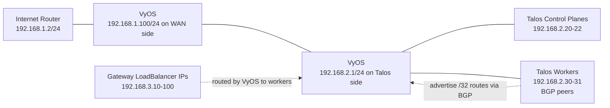

# Talos on Proxmox

This Terraform project builds a Talos Kubernetes cluster on Proxmox from a Talos NoCloud VM template.

It provisions:

- 3 control-plane VMs
- 2 worker VMs
- static node IPs
- a control-plane VIP
- stable hostnames through NoCloud metadata
- Talos bootstrap and local `talosconfig`/`kubeconfig`
- Gateway API CRDs
- Cilium with kube-proxy replacement
- Hubble relay and UI
- optional Gateway API exposure for Hubble UI
- Cilium `LoadBalancerIPPool` for Gateway addresses
- optional Cilium BGP peering from the worker nodes to an external router
- optional Cilium L2 announcements for Gateway reachability

## Requirements

- a Proxmox VM template built from a Talos NoCloud image
- `talos_template_vmid` set to that template ID
- a datastore with `snippets` enabled for `proxmox_snippet_datastore`
- `talosctl`, `kubectl`, and `helm` installed on the machine running Terraform
- Cilium is pinned to the current latest release in `terraform.tfvars.example`

If Terraform cannot find those CLIs on `PATH`, set these in `terraform.tfvars`:

- `talosctl_command`
- `kubectl_command`
- `helm_command`

## Create the Talos Template

Create the Proxmox template from a Talos NoCloud disk image, not from the ISO.

1. Download a Talos NoCloud raw image from Image Factory that matches `talos_version`.
2. Import it into Proxmox and attach it as `scsi0`.
3. Convert the VM to a template.
4. Set `talos_template_vmid` in `terraform.tfvars` to that template ID.

Example on the Proxmox host:

```bash
wget -O /var/lib/vz/template/cache/talos-nocloud.raw.xz <talos-image-factory-url>
unxz -f /var/lib/vz/template/cache/talos-nocloud.raw.xz

qm create 9000 --name talos-nocloud-template --memory 4096 --cores 2 \
  --net0 virtio,bridge=vmbr0 --scsihw virtio-scsi-pci --serial0 socket --vga serial0

qm importdisk 9000 /var/lib/vz/template/cache/talos-nocloud.raw local-lvm
qm set 9000 --scsi0 local-lvm:vm-9000-disk-0
qm set 9000 --boot order=scsi0
qm set 9000 --ostype l26
qm template 9000
```

Adjust the bridge, datastore, and image URL to match your environment.

## Workflow

1. Create or update `terraform.tfvars`.
2. Run `terraform init`.
3. Run `terraform apply`.

The first apply can take a while while Talos boots, Cilium images are pulled, and all nodes become `Ready`.

If `expose_hubble_via_gateway = true`, Terraform also creates a `Gateway` and `HTTPRoute` for the `hubble-ui` service in `kube-system`.
If `install_cilium_lb_pool = true`, Terraform also creates a `CiliumLoadBalancerIPPool`.
If `enable_cilium_bgp = true`, Terraform also enables the Cilium BGP control plane and creates BGP resources for the worker nodes.
If `enable_cilium_l2_announcements = true`, Terraform also creates a `CiliumL2AnnouncementPolicy` for the Hubble Gateway service.

## Post-Install Checks

Verify that all Kubernetes nodes are ready:

```powershell
kubectl --kubeconfig .\kubeconfig get nodes -o wide
```

Verify that Gateway API is installed and accepted by Cilium:

```powershell
kubectl --kubeconfig .\kubeconfig get gatewayclass
kubectl --kubeconfig .\kubeconfig get crd | findstr gateway.networking.k8s.io
```

Verify the Hubble Gateway and route:

```powershell
kubectl --kubeconfig .\kubeconfig -n kube-system get gateway,httproute
kubectl --kubeconfig .\kubeconfig get CiliumLoadBalancerIPPool
kubectl --kubeconfig .\kubeconfig get ciliuml2announcementpolicies
```

Verify that Hubble UI is reachable through the Gateway IP:

```powershell
kubectl --kubeconfig .\kubeconfig -n kube-system get svc cilium-gateway-hubble
```

Open the `EXTERNAL-IP` from that service in a browser, for example `http://192.168.3.10`.

If BGP mode is enabled, verify the BGP sessions and advertised routes:

```powershell
cilium bgp peers --kubeconfig .\kubeconfig
cilium bgp routes advertised --kubeconfig .\kubeconfig
```

Optional Talos checks:

```powershell
talosctl --talosconfig .\talosconfig --nodes 192.168.2.20 --endpoints 192.168.2.20 get members
talosctl --talosconfig .\talosconfig --nodes 192.168.2.20 --endpoints 192.168.2.20 version
```

Optional Cilium CLI checks:

```powershell
cilium status --wait --wait-duration 5m --kubeconfig .\kubeconfig
cilium features status --kubeconfig .\kubeconfig
cilium hubble port-forward --kubeconfig .\kubeconfig
cilium connectivity test --kubeconfig .\kubeconfig
```

## Notes

- `talos_template_node` can be left empty if the template lives on `proxmox_node`
- control-plane and worker IP ranges must be valid on your network
- control-plane nodes and workers are both configured with 50 GB disks by default
- the default Cilium load balancer pool in this repo uses `192.168.3.10-192.168.3.100`
- the default BGP design in this repo peers worker nodes with `192.168.2.1`
- the default L2 announcement interface selector in this repo is `^eth0$`

## BGP Mode

This branch can expose Gateway `LoadBalancerIP` addresses through Cilium BGP instead of L2 announcements.

Default BGP settings in this repo:

- worker peers: `192.168.2.30` and `192.168.2.31`
- router peer: `192.168.2.1`
- Cilium ASN: `64513`
- router ASN: `64512`
- `LoadBalancerIP` pool: `192.168.3.10-192.168.3.100`

Relevant Terraform variables:

- `enable_cilium_bgp = true`
- `enable_cilium_l2_announcements = false`
- `cilium_bgp_local_asn`
- `cilium_bgp_peer_asn`
- `cilium_bgp_peer_address`
- `cilium_bgp_peer_name`
- `cilium_lb_pool_start`
- `cilium_lb_pool_stop`

Network design:



The important detail on VyOS is that the BGP `router-id` should be the Talos-side address:

```vyos
set protocols bgp parameters router-id '192.168.2.1'
```

This repo assumes VyOS peers with the worker nodes over the `192.168.2.0/24` network. If your actual VyOS interface names differ from your lab notes, keep the IP design the same and adjust only the interface names.

Example VyOS configuration:

VyOS configuration steps:

1. Enter configuration mode with `configure`.
2. Set the VyOS local ASN and router ID.
3. Create a prefix-list that only accepts `/32` service IPs from `192.168.3.0/24`.
4. Create a route-map that uses that prefix-list for inbound BGP routes.
5. Add both worker nodes as BGP neighbors with remote ASN `64513`.
6. Apply the inbound route-map to each neighbor for `ipv4-unicast`.
7. Commit and save the configuration.

```vyos
configure

set protocols bgp system-as '64512'
set protocols bgp parameters router-id '192.168.2.1'
set protocols bgp parameters log-neighbor-changes

set policy prefix-list CILIUM-LB rule 10 action 'permit'
set policy prefix-list CILIUM-LB rule 10 prefix '192.168.3.0/24'
set policy prefix-list CILIUM-LB rule 10 ge '32'
set policy prefix-list CILIUM-LB rule 10 le '32'

set policy route-map CILIUM-IN rule 10 action 'permit'
set policy route-map CILIUM-IN rule 10 match ip address prefix-list 'CILIUM-LB'

set protocols bgp neighbor 192.168.2.30 remote-as '64513'
set protocols bgp neighbor 192.168.2.30 address-family ipv4-unicast route-map import 'CILIUM-IN'

set protocols bgp neighbor 192.168.2.31 remote-as '64513'
set protocols bgp neighbor 192.168.2.31 address-family ipv4-unicast route-map import 'CILIUM-IN'

commit
save
exit
```

Useful verification commands after `terraform apply`:

```powershell
kubectl --kubeconfig .\kubeconfig -n kube-system get svc cilium-gateway-hubble -o wide
cilium bgp peers --kubeconfig .\kubeconfig
cilium bgp routes advertised --kubeconfig .\kubeconfig
```

On VyOS:

```vyos
show ip bgp summary
show ip bgp
show ip route 192.168.3.10
```

If everything is working, `cilium bgp peers` should show both worker sessions as `established`, and `cilium bgp routes advertised` should show `192.168.3.10/32` advertised to `192.168.2.1`.

## Troubleshooting

If the Gateway service gets an external IP but that IP does not answer ARP or HTTP on the LAN:

1. Verify the running Cilium config:

```powershell
kubectl --kubeconfig .\kubeconfig -n kube-system exec ds/cilium -- cilium-dbg config --all | findstr /I "Devices EnableL2Announcements"
```

2. If `EnableL2Announcements` is still `false` even though the Helm values are correct, restart the Cilium DaemonSet:

```powershell
kubectl --kubeconfig .\kubeconfig -n kube-system rollout restart ds/cilium
kubectl --kubeconfig .\kubeconfig -n kube-system rollout status ds/cilium
```

3. Test again from another machine on the same LAN:

```powershell
curl http://192.168.3.10
```
